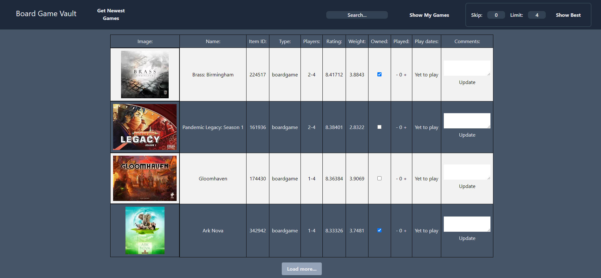
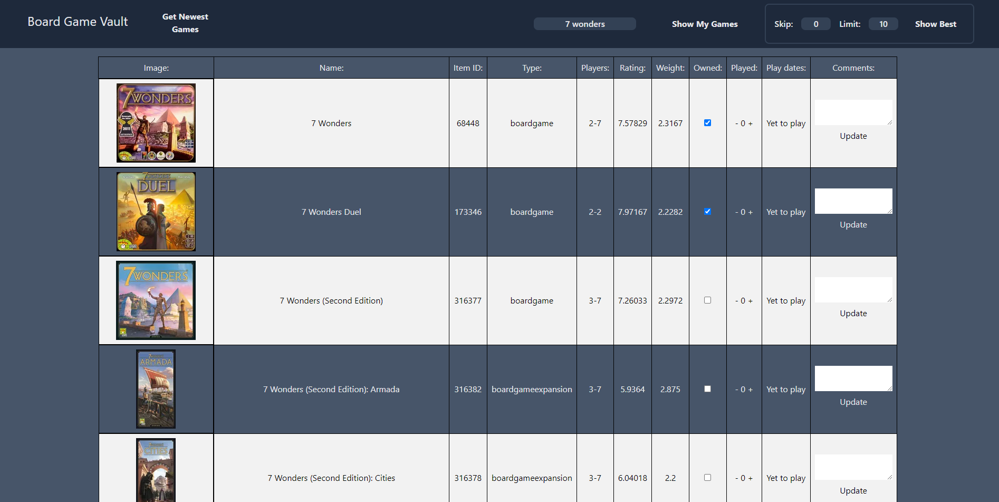

# Boardgame Collection Vault

This project is a Python-based web application built with FastAPI, HTMX and SQLAlchemy, designed to help users manage their boardgame collection. It provides a user-friendly interface for managing boardgames, including  for games, viewing owned games, and updating game details.
I built it beacause all the sites on the market became too bloated for me. Also I want to built some ML models based on the data.

## Features

- **Home Page**: Displays a welcome message and general information about the application.
- **Top Games**: Get a closer look at the most liked games.
- **Search option**: Search for any game by name.
- **Owned Games**: Displays a list of all boardgames owned by the user.
- **Get New Data**: Fetches new data from the Board Game Geek (BGG) API.
- **Item Details**: If you need to know more about a game click it's title and it will open the games BGG site.
- **Update Game Details**: Users can update the details of a boardgame, such as the number of times it has been played and any comments about the game.

## Screenshots

## Tech Stack

- **Python**
- **FastAPI**
- **SQLAlchemy**
- **Jinja2**
- **TailwindCSS**
- **Htmx**

## Setup

1. Clone the repository.
2. Install the required Python packages using pip.
3. Connect a working Postgres database.
4. Run the application.

## Future
- **Docker image**: For easy of instalation.
- **More sorting methods**: Look at Games by sorting them how you like to.
- **Machine Learning Model**: Get similar Games recommendations.

## Usage

The application provides several endpoints for interacting with the boardgame data:

- `/`: The home page.
- `/get_new_data`: Fetches new data from the BGG API.
- `/item`: Displays detailed information about a specific boardgame.
- `/items`: Displays a list of all boardgames.
- `/search`: Allows users to search for boardgames.
- `/owned`: Displays a list of all owned boardgames.
- `/item/update_owned/{updated_id}`: Updates the ownership status of a boardgame.
- `/item/update_played/add/{updated_id}`: Increments the "times played" count of a boardgame.
- `/item/update_played/subs/{updated_id}`: Decrements the "times played" count of a boardgame.
- `/item/update_comments/{updated_id}`: Updates the comments of a boardgame.
